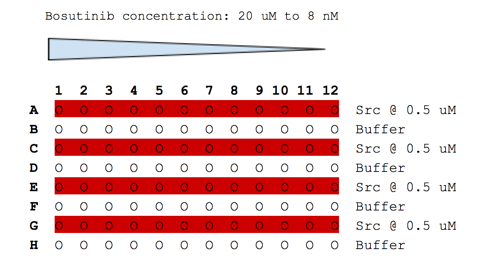

#A simple experiment to get saturation binding curves from fluorescent kinase inhibitors.

This protocol fills two plates with alternating rows of Protein in Buffer (usually 0.5 uM Src) and just Buffer. 
Each well is 100 uL and dispensed using single pipetting in two 96 well plates. Ligand is then added to both 
plates in a half log dilution starting from 20 uM using the D300. Results are gathered for two ligands 
simultaneously: the ligand names are defined as variables in Momentum before the script is run.

The plates then get shaken to mix, centrifuged and the fluorescence read. 

## Relevant Scripts
- Momentum Process: EXP_FLU_Kinase_Inhibitors_1
- Momentum Experiment: E_EXP_FLU_Kinase_Inhibitors_1
- EVO Scrtips: EXP_FLU_Kinase_Inhibitors_1_Lig1 and EXP_FLU_Kinase_Inhibitors_1_Lig2
- D300 Scripts: Src_Bos_96well_Nov2014_well12.DATA.xml and Src_Bos_96well_Nov2014_well34.DATA.xml
- Infinite Script: EXP_FLU_Kinase_Inhibitors_1  

## Procedure
- Prepare 14 mL of 0.5 µM Src (9.6 should be enough for two experiments, but good to have over) in Kinase Buffer (in fridge).
 - Use tube from either -80ºC or 4ºC.
 - Spin down (5000 rcf for 10 min at 4C).
 - Measure concentration using denovix (Src should be preprogrammed).
 - Convert to moles (MW of Src is 32.5 kDa).
 - Add appropriate amount to total 14 mL.
- Run maintenance script MAINT_Wash on EVO.
- Load Kinase Buffer into 100 mL trough, Protein into 25 mL trough, fresh D300 chip, DMSO, Ligand_1 (in this case Gefitinib), and Ligand_2 (in this case Erlotinib) according to the image below.

- Place 2 clean 4ti_0223 (96 well, black clear bottom) plates in Stack 4 of cytomat (Nests 1 and 2).
- Run Momentum Script. Make sure you have defined right ligand names as variables, also make sure to name the two infinite output files accordingly.
- Infinite results file will be output to google drive.
- Using assaytools run xml2png on output xml files. 

### Kinase Buffer Instructions (if needed)

To make 2L of 20 mM Tris 0.5 mM TCEP pH 8:

#### Materials:
- TCEP: Biosynth C1818 Lot 0000009688 MW 286.65 g/mol
- 1M Tris pH 8: Fisher Bioreagents BP1758-500 Lot 135742
- 1L graduated cylinder
- 2 x 2L glass beaker

#### Preparation:
- add 40 mL of 1M Tris pH 8 to graduated cylinder
- add 286.65 mg TCEP to graduated cylinder [actual: 288.2 mg]
- fill up cylinder to 2L with ddH2O (Purelab Ultra)
- add stir bar to graduated cylinder and stir to dissolve TCEP
- transfer everything to 2L glass beaker on stir plate and adjust pH to pH 8 by titration with conc HCl or NaOH
[initial pH was ~7.81; final pH was 7.99 after adding 10% NaOH dropwise]
- filter into sterile container

