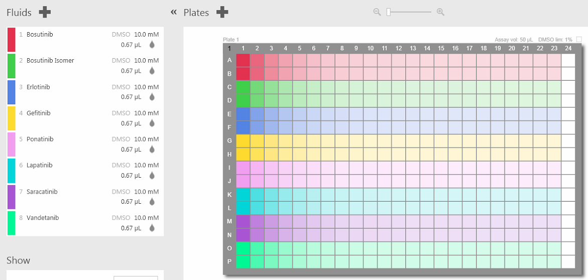
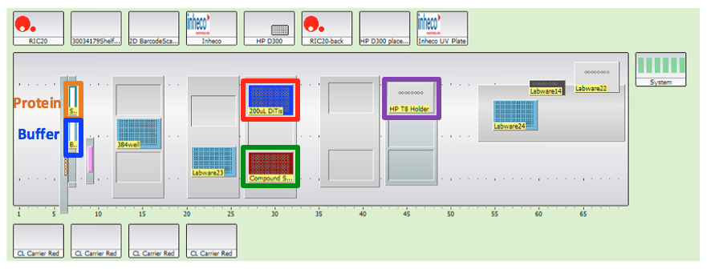

This protocol fills one 384-well plate with alternating rows of Protein in Buffer (0.5 uM of kinase) and just Buffer. Each well is 50 uL and dispensed using single pipetting. Eight different ligands are then added in a dilution starting from 20 uM and ending at 8nM using the D300. The plate then gets shaken to mix, centrifuged and the fluorescence read.

## Relevant Scripts 
- Momentum Process: EXP_FLU_Singlet
- Momentum Experiment: E_EXP_FLU_Singlet
- EVO Scripts: EXP_FLU_Singlet
- D300 Scripts: Singlet_Test_SMH_LRL_April2016 2016-04-22 1527.DATA.xml
- Infinite Script: EXP_FLU_Singlet_Part1.mdfx and EXP_FLU_Singlet_Part2.mdfx

## Procedure
- If needed make compound stock plate as described [here](https://github.com/choderalab/wetlab-protocols/blob/updates/Compound_Stock_Plate_Preparation/Compound_Stock_Plate_Preparation.md).
- Prepare 14 mL of 0.5 µM kinase (9.6 should be enough for two experiments, but good to have over) in Kinase Buffer (in fridge).
  - Use tube from -80ºC.
  - Spin down (5000 rcf for 10 min at 4C).
  - Measure concentration using denovix (most proteins we use should be preprogrammed).
  - Calculate appropriate amount to get 1 uM in total 14 mL using `protein_volume_calculation.py` [here](https://github.com/choderalab/wetlab-protocols/blob/updates/Frequent_calculations_during_experiment_preparation/WIP_python_scripts/protein_volume_calculation.py).
- Run maintenance scripts: MAINT_Wash and MAINT_Rehome on EVO.
- Load Kinase Buffer into 100 mL trough, Protein into 25 mL trough, fresh D300 chip (Purple rectangle), 200 uL SBS DiTis (red rectangle) and appropriate Compound Stock Plate (Green rectangle).

- Set DiTi position on EVOware.
- Set the compound stock plate aspiration position on EVOware. 
- Place 1 clean 4ti_0203 (384 well, clear) plate in Stack 4 of cytomat (Nest 1).
- Make sure to name the two infinite output files accordingly.
- Run Momentum Script. E_EXP_FLU_Singlet
- Infinite results file will be output to Google Drive (choderalab/automation/protocols/infinite/results).

## Kinase Buffer Instructions (if needed)

USE THE REVO. Otherwise:

To make 2L of 20 mM Tris 0.5 mM TCEP pH 8:

#### Materials:
- TCEP: Biosynth C1818 Lot 0000009688 MW 286.65 g/mol
- 1M Tris pH 8: Fisher Bioreagents BP1758-500 Lot 135742
- 1L graduated cylinder
- 2 x 2L glass beaker

#### Preparation:
- add 40 mL of 1M Tris pH 8 to graduated cylinder
- add 286.65 mg TCEP to graduated cylinder [actual: 288.2 mg]
- fill up cylinder to 2L with ddH2O (Purelab Ultra)
- add stir bar to graduated cylinder and stir to dissolve TCEP
- transfer everything to 2L glass beaker on stir plate and adjust pH to pH 8 by titration with conc HCl or NaOH [initial pH was ~7.81; final pH was 7.99 after adding 10% NaOH dropwise]
- filter into sterile container
