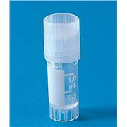

# A SOP for creating glycerol stocks in the Chodera Lab 

Based on the [Addgene (Glycerol Stock)](https://www.addgene.org/protocols/create-glycerol-stock/) and [Addgene liquid culture](https://www.addgene.org/protocols/inoculate-bacterial-culture/) protocols 

### Materials 
* Sterile LB media 
* Antibiotic (determined by plasmid)
* Sterile culture tube 
* 200uL pipet tip 
* transformed LB agar plate with colonies 
* Sterile 50% glycerol stock solution 
* Cryovial (screw top) 
* Liquid nitrogen 
* bunsen burner 

**Example Cryovial** grabbed from [Thomas Scientific](https://www.thomassci.com/Laboratory-Supplies/Cryogenic-Vials/_/CRYOGENIC-VIALS-AND-CONTAINERS?q=Cryotube)

### Preparation 

* Prepare LB according to directions on the power and autoclave using one of the liquid settings
* Antibiotic is typically made in batches and stored in 1000x concentrations in the -20°C 
* 50% glycerol should be prepared from 100% glycerol and millipore water, then autoclaved using liquid settings 
* Transformed LB agar plate can be prepared following this [SOP](https://github.com/choderalab/wetlab-protocols/blob/master/Competent_Cells_Transformation/Transformation.md)

### Procedure 

#### Day 1 
* Wipe down bench surface and gloves with ethanol. Once gloves are dry, carefully light the bunsen burner 
* Add 5mL LB to to a sterile culture tube in front of Bunsen burner. Flame sterilize the mouth of the LB bottle 
* Add antibiotic to the culture (most antibiotic stocks in the lab are 1000x concentration, so add 5uL antibiotic to a 5mL culture)
* Using a pipet tip, pick a single colony from the transformed plate. Drop the colony and tip into the culture 
* Loosely cover the culture with a cap or aluminum foil  
* Shake culture overnight at 37°C, 225-250 rpm

#### Day 2
* Check the culture for growth (it should be cloudy) 
* Add 500uL 50% glycerol and 500uL overnight culture to a cryovial tube 
* Check that the stock is well mixed and uniform. There should be no layers in the tube. 
* Freeze in liquid nitrogen and store in the -80°C fridge 
* Glycerol stocks are stored in a box in Shelf 11 of the -80°C freezer. 

#### Record Keeping

* Add an entry to glycerol stock sheet of the [Chodera Lab Plasmid Library](https://docs.google.com/spreadsheets/d/1b-H7a3in7lu-r7KzwA7vuxOoumuTF1xGWB-hPrwuYCw/edit?usp=drive_web)
* We currently store glycerol stocks in a box in Shelf 11 of -80°C freezer. If you create a new box or change location, update the [Chodera Lab Fridge and Freezer Inventory](https://docs.google.com/spreadsheets/d/1F-x4JrbIAd96WqROiASZuANYdQVlM8HLVpmyp_6wbBY/edit#gid=1071795149)

### Notes

* Glycerol stocks can be made from the same culture as a miniprep, so combining these two tasks is useful
* Bacteria from this culture can be recovered by [streaking an agar plate](https://www.addgene.org/protocols/streak-plate/)